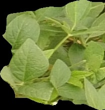
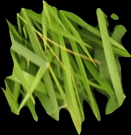
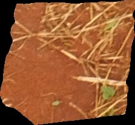
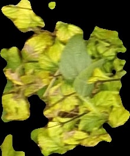

# Weed Detection
Weed Detection in Soybean Crops with Neural Network

## Sample Images

| Soybean       | Grass     | Soil      | Broadleaf     |
| --------------|-----------|-----------|---------------|
|   |    |      |      |

## Project Description

In this project, we build a simple convolutional neural network that achieves > 90% accuracy.

## Prior work

Ferreira et al, demonstrated 99% accuracy on the weed dataset with a Convolutional Neural Networks trained using CaffeNet architecture, which is a replication of AlexNet architecture.

Ferreira, Alessandro & Freitas, Daniel & Silva, Gercina & Pistori, Hemerson & Folhes, Marcelo. (2017). Weed detection in soybean crops using ConvNets. Computers and Electronics in Agriculture. 143. 314-324. 10.1016/j.compag.2017.10.027. 
https://www.researchgate.net/publication/321435244_Weed_detection_in_soybean_crops_using_ConvNets

## Data set
https://data.mendeley.com/datasets/3fmjm7ncc6/2
